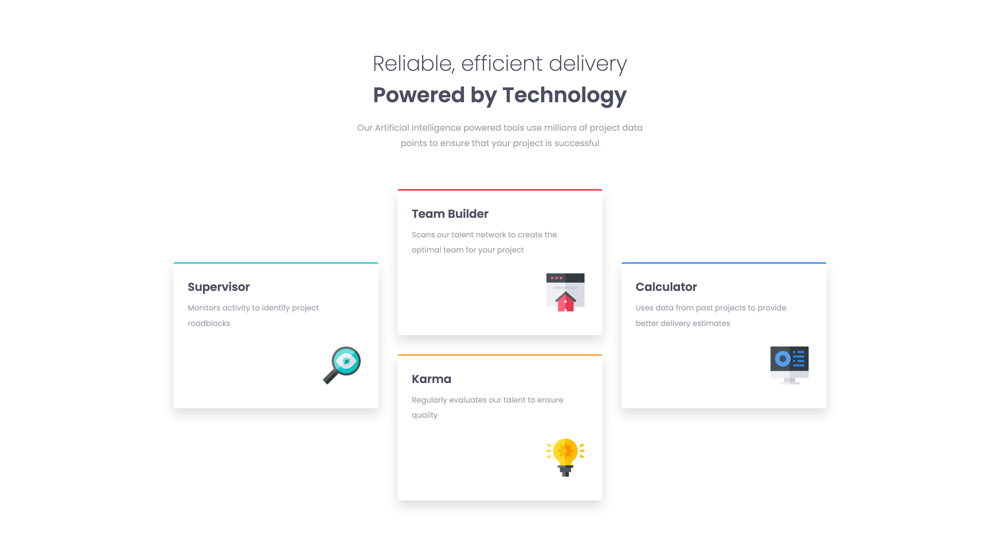
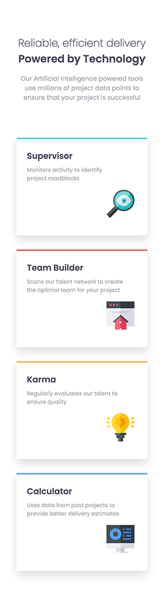

### Links

- [Solution URL:](https://github.com/Smgy94/frontend-mentor-four-card-feature-section-master)
- [Live Site URL:](https://smgy94.github.io/frontend-mentor-four-card-feature-section-master/)

# Frontend Mentor - Four card feature section solution

This is a solution to the [Four card feature section challenge on Frontend Mentor](https://www.frontendmentor.io/challenges/four-card-feature-section-weK1eFYK). Frontend Mentor challenges help you improve your coding skills by building realistic projects.

## Table of contents

- [The challenge](#the-challenge)
- [Screenshot](#screenshot)
- [Links](#links)
- [Built with](#built-with)
- [What I learned](#what-i-learned)
- [Useful resources](#useful-resources)
- [Author](#author)

### The challenge

Users should be able to:

- View the optimal layout for the site depending on their device's screen size

### Screenshot

### Built with

- Semantic HTML5 markup
- CSS custom properties
- Flexbox
- CSS Grid
- Mobile-first workflow

## Author

- LinkedIn - [@shanemcgeown](https://www.linkedin.com/in/shanemcgeown/)
- Frontend Mentor - [@Smgy94](https://www.frontendmentor.io/solutions/four-card-feature-section-EBmaBClM7A)
- Twitter - [@ShaneMcGeown94](https://twitter.com/ShaneMcGeown94)
